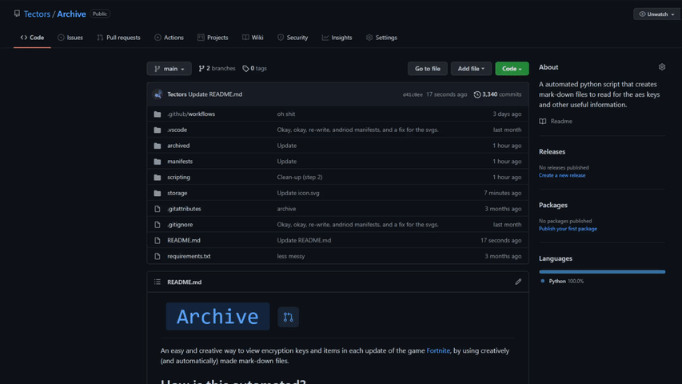

#  

An easy and creative way to view encryption keys and items in each update of the game [Fortnite](https://www.epicgames.com/fortnite/en-US/home), by using creatively (and automatically) made mark-down files.

# How is this automated?

It is automated using [Github Actions](https://docs.github.com/en/actions) and by using the programming language Python.

**How is it running it automatically without a user's command?**:
  It uses a [python application file](https://github.com/Tectors/Archive/blob/main/.github/workflows/python-app.yml) that'll command the actions to run each specified amount of minutes. 

**Where is it getting it's information from?**:
  [Fortnite-Central](https://t.co/cdzweItxer)  *API for Fortnite.*

# Why should I use this?

**Why doesn't it contain other versions?**:
  Well the simple fact is that not a single api has supported old versions and probably won't, even if we have the keys we would have to manually do everything.

**Reasons Why**:
1. The repo is very maintained and get's updates usually which contain new or bug fixes
2. Nobody has to run this, so no labor is needing making it so you rely on a computer not a human updating it
3. It can show you the items and cosmetics added in dynamic packages
4. It looks cool, and the design is still being developed
5. Easy to access, you can find information about a version easily

# [Where is the files?](https://github.com/Tectors/Archive/tree/main/tree)

**Where is the mark-down files?**:
  The mark-down files are located in the **tree** folder, the last file is always the current version of [Fortnite](https://www.epicgames.com/fortnite/en-US/home).

**Where is the source code for the Github Actions?**:
  The source files that [Github Actions](https://docs.github.com/en/actions) are running Python are in the scripting folder, the main file that it runs is the [generation.py](https://github.com/Tectors/Archive/blob/master/source/python-application/generation.py) file.

**Where is the Scalable Vector assets at?**:
  The assets (svg) for the mark-down files are located in the *storage* folder, [click here to the latest one.](https://github.com/Tectors/Archive/blob/master/source/dependents/gen.28.30.svg)

**Where did you get those icons from?**:  
We use [octicon icons](https://primer.style/octicons/) to style our mark-down files and SVGs as they look pretty, and pretty good.